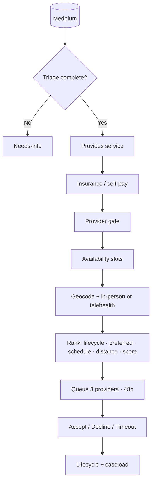
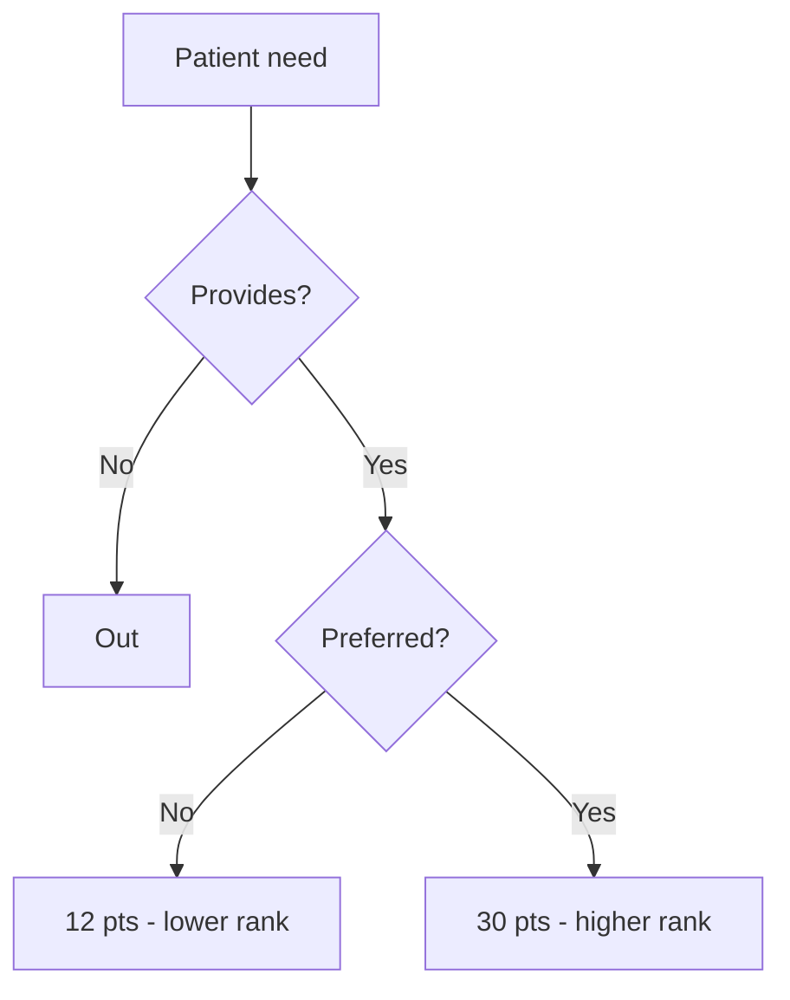

# Therapy routing — full architecture (preset)

**Assumption:** All data lives in **Medplum** (patients, providers, insurance, schedules, preferred services).  
**Goal:** Match each patient to the best providers; **preferred-service** patients score higher than patients who only meet the provider’s basic discipline.

---

## Table of contents

1. [Full system diagram (always visible)](#full-system-diagram-always-visible)
2. [Medplum data — what feeds matching](#medplum-data--what-feeds-matching)
3. [Patient paths](#patient-paths)
4. [Matching pipeline (step by step)](#matching-pipeline-step-by-step)
5. [Service fit: provides vs preferred](#service-fit-provides-vs-preferred)
6. [Scoring and rank order](#scoring-and-rank-order)
7. [Three-provider queue and 48 hours](#three-provider-queue-and-48-hours)
8. [Provider lifecycle and capacity](#provider-lifecycle-and-capacity)
9. [Provider profile (what staff see)](#provider-profile-what-staff-see)
10. [API keys](#api-keys)
11. [What the app implements today](#what-the-app-implements-today)

---

## Full system diagram (always visible)

This block renders in any editor (no special preview needed).

```
┌─────────────────────────────────────────────────────────────────────────────┐
│                         MEDPLUM (system of record)                          │
├──────────────────────────────┬──────────────────────────────────────────────┤
│ PATIENT                      │ PROVIDER                                     │
│ • Patient + Address          │ • Practitioner + PractitionerRole            │
│ • Coverage (insurance/self)  │   – discipline, lifecycle, capacity        │
│ • ServiceRequest (need)      │   – preferredServices  ◄── higher score    │
│ • Availability + telehealth  │   – insurance networks                     │
│                              │ • Schedule + Slot (open times)             │
│                              │ • Accepting Y/N                              │
├──────────────────────────────┴──────────────────────────────────────────────┤
│ TASK — offer · accept · decline · 48h clock · caseload count               │
└─────────────────────────────────────────────────────────────────────────────┘
                                      │
                                      ▼
┌─────────────────────────────────────────────────────────────────────────────┐
│ ① TRIAGE — every patient                                                  │
│    Has location + service + billing?                                        │
│    NO  ──► Needs-info queue (Claude drafts outreach; staff fixes Medplum)   │
│    YES ──► enter matching                                                   │
└─────────────────────────────────────────────────────────────────────────────┘
                                      │
                                      ▼
┌─────────────────────────────────────────────────────────────────────────────┐
│ ② HARD FILTERS (in order — before geocoding)                                │
│    1. PROVIDES — discipline covers patient need (SLP/OT/PT)                 │
│    2. INSURANCE — in-network OR self-pay (self-pay → more providers)        │
│    3. PROVIDER — accepting, licensed in state, not at capacity             │
│    4. AVAILABILITY — patient times ∩ provider open slots                   │
└─────────────────────────────────────────────────────────────────────────────┘
                                      │
                                      ▼
┌─────────────────────────────────────────────────────────────────────────────┐
│ ③ GEOCODE + REACHABILITY (survivors only)                                   │
│    AWS street-level (ZIP fallback)                                          │
│    In-person if within radius OR telehealth if BOTH allow virtual           │
└─────────────────────────────────────────────────────────────────────────────┘
                                      │
                                      ▼
┌─────────────────────────────────────────────────────────────────────────────┐
│ ④ RANK (smart sort)                                                         │
│    1. Lifecycle: Pending 1st first                                          │
│    2. Preferred service YES before NO  ◄── key differentiator             │
│    3. Schedule overlap strength                                             │
│    4. Distance (or telehealth tier)                                         │
│    5. Composite score 0–100 (see scoring table)                             │
└─────────────────────────────────────────────────────────────────────────────┘
                                      │
                                      ▼
┌─────────────────────────────────────────────────────────────────────────────┐
│ ⑤ THREE-PROVIDER QUEUE (per patient)                                       │
│    Pick top 3 from ranked list (Pending 1st favored)                          │
│    #1 ACTIVE (requested) — provider sees patient — 48h to accept            │
│    #2, #3 ON HOLD — activate if #1 declines or times out                    │
│    Accept → caseload +1, cancel other offers, update lifecycle              │
│    All 3 exhausted → manual review                                          │
└─────────────────────────────────────────────────────────────────────────────┘
                                      │
                                      ▼
┌─────────────────────────────────────────────────────────────────────────────┐
│ ⑥ LIFECYCLE                                                                 │
│    Pending 1st → Fill to 80% → Steady state → At capacity                   │
│    Fill to 80%: target 80% on dashboard, can still accept to FULL capacity  │
└─────────────────────────────────────────────────────────────────────────────┘
```

---

## Medplum data — what feeds matching

| Medplum resource | What it holds | Matching use |
|------------------|---------------|--------------|
| **Patient** | Identity | Display |
| **Patient.address** | Street, city, state, ZIP | Geocode; license state |
| **Coverage** | Payer, plan, self-pay vs insurance | In-network filter; self-pay sees more providers |
| **ServiceRequest** | Speech / OT / PT (or combined) | **Provides** filter + patient need |
| **Patient (extension)** | Days/times available, telehealth OK, urgency | Slot overlap; in-person vs virtual |
| **Practitioner** | Name, identity | Display |
| **PractitionerRole** | Discipline, region, lifecycle, capacity, accepting | Gate + lifecycle priority |
| **PractitionerRole.preferredServices** | Cases they *want* (e.g. pediatric speech) | **+18 score** vs provides-only |
| **PractitionerRole.networks** | Accepted insurance payers | Hard filter for insurance patients |
| **Schedule / Slot** | Real open appointment times | Availability filter |
| **Task** | Suggestion, accept, decline, timestamps | Queue, 48h, caseload |

---

## Patient paths

```
                    ┌──────────────┐
                    │   Patient    │
                    └──────┬───────┘
                           │
              ┌────────────┴────────────┐
              │                         │
        missing data?              complete data
              │                         │
              ▼                         ▼
      ┌───────────────┐         ┌───────────────┐
      │  NEEDS-INFO   │         │   MATCHING    │
      │  + outreach   │         │   pipeline    │
      └───────────────┘         └───────┬───────┘
                                        │
                        ┌───────────────┼───────────────┐
                        │               │               │
                        ▼               ▼               ▼
                 ┌──────────┐   ┌──────────┐   ┌──────────────┐
                 │ Suggested│   │ Accepted │   │ Manual review│
                 │ (in queue)│   │ (on case)│   │ (no provider)│
                 └──────────┘   └──────────┘   └──────────────┘
```

---

## Matching pipeline (step by step)

| Step | What happens | Data used |
|------|----------------|-----------|
| **1. Provides** | Provider discipline must cover patient need | ServiceRequest + PractitionerRole |
| **2. Insurance** | Insurance: payer in network. Self-pay: always OK | Coverage + networks |
| **3. Provider gate** | Accepting, same state, not at capacity / not live | PractitionerRole |
| **4. Availability** | At least one shared day/time window | Patient availability + Schedule/Slot |
| **5. Geocode** | Lat/lon for patient and provider | Address + AWS (ZIP fallback) |
| **6. Reachability** | In-person within radius, OR telehealth if both OK | Distance + telehealth flags |
| **7. Score** | 0–100 per pair | Full scoring table below |
| **8. Queue** | Top 3 providers; #1 active 48h | Task + lifecycle priority |

---

## Service fit: provides vs preferred

Two tiers — this is how preferred patients beat “eligible only” patients.

| Tier | Question | Rule | Points |
|------|----------|------|--------|
| **Provides** | Can they treat this? | Discipline matches need (e.g. SLP + speech) | **Required.** If pass: **+12** |
| **Preferred** | Do they *want* this case? | Patient need ∈ `preferredServices` | **+18 more** (total **30**) |

```
Patient need: "Speech therapy, pediatric"
                    │
                    ▼
         ┌──────────────────────┐
         │ Discipline covers    │─── NO ──► Not matched
         │ need? (PROVIDES)     │
         └──────────┬───────────┘
                    │ YES (+12 pts)
                    ▼
         ┌──────────────────────┐
         │ In preferredServices?│─── NO ──► Matched, LOWER rank (12 pts)
         └──────────┬───────────┘
                    │ YES (+18 pts)
                    ▼
              PREFERRED MATCH (30 pts)
              Listed higher on provider profile
              Higher in 3-provider queue
```

**Example (same distance, same schedule):**

| Patient | Provides? | Preferred? | Service points | On provider list |
|---------|-----------|------------|----------------|------------------|
| Pediatric speech | Yes | Yes | 30 | Top |
| Adult speech | Yes | No | 12 | Below preferred cases |
| OT case | No | — | — | Not shown |

---

## Scoring and rank order

**Composite score (max ~100)** — only for pairs that passed all filters.

| Factor | Points | Notes |
|--------|--------|--------|
| Provides service (base) | 12 | Always if eligible |
| Preferred service boost | +18 | Only if in `preferredServices` |
| Schedule overlap | up to 15 | Stronger overlap = higher |
| Distance / closeness | up to 22 | Closer in-person wins |
| Telehealth fit | up to 5 | When mode is virtual |
| Lifecycle | up to 12 | Pending 1st highest |
| Self-pay bonus | 6 | Tie-break vs insurance at same distance |
| Start urgency | up to 5 | Soon + near-term slots |

**Sort order (apply in this sequence):**

1. Lifecycle (**Pending 1st** first)  
2. **Preferred service** (yes before no)  
3. Schedule overlap  
4. Distance (or telehealth)  
5. Total composite score  

---

## Three-provider queue and 48 hours

Per complete patient:

```
Ranked list:  [Provider A] [Provider B] [Provider C] [Provider D] ...
                    │              │              │
                    ▼              ▼              ▼
Queue:      ┌──────────┐  ┌──────────┐  ┌──────────┐
            │ #1 ACTIVE│  │ #2 HOLD  │  │ #3 HOLD  │
            │ 48h clock│  │ waiting  │  │ waiting  │
            └────┬─────┘  └──────────┘  └──────────┘
                 │
     ┌───────────┼───────────┐
     │           │           │
  ACCEPT      DECLINE     TIMEOUT
     │           │           │
     ▼           └─────┬─────┘
 Caseload +1          ▼
 Cancel #2,#3    Activate #2, then #3
 Update lifecycle
```

- **Pending 1st** providers are prioritized when building the ranked list and queue.  
- Only **#1** appears on the provider’s profile until they act.  
- **Self-pay** patients can appear in more providers’ queues (not blocked by network).

---

## Provider lifecycle and capacity

| Stage | Matching priority | Dashboard capacity | Can still accept? |
|-------|-------------------|--------------------|-------------------|
| **Pending 1st** | Highest | Full stated (e.g. 10) | Yes, up to full |
| **Fill to 80%** | Normal | Shows **80% target** (8/10) | Yes, up to **full** 10 |
| **Steady state** | Normal | Full stated | Yes, until full |
| **At capacity** | None | Full | No — auto when accepted = full |

**Auto transitions**

- Fill to 80% + accepted ≥ 80% target → **Steady state**  
- Accepted = full stated capacity → **At capacity** (accepting → N)

---

## Provider profile (what staff see)

1. **Active offers only** (48h) — sorted by distance, then score.  
2. **Preferred** patients appear above provides-only patients.  
3. Optional **Claude “why this fits”** (distance, service, insurance, schedule) — does not decide matching.  
4. **Add** → caseload +1. **Decline** + reason → next provider in queue.  
5. Caseload bar: **accepted / full capacity**, with 80% milestone when in Fill-to-80%.

---

## API keys

| Key | When | Does | Does not |
|-----|------|------|----------|
| **Anthropic** | Upload / sync | Clean bad data; needs-info outreach; optional fit summary | Pick who gets matched |
| **AWS Location** | After filters | Geocode patient + provider | Insurance or capacity rules |

```
Medplum sync ──► Matching engine (rules only) ──► Tasks / dashboard
                      │
                      ├──► AWS geocode
                      └──► Anthropic (cleanup + optional summary text)
```

---

## What the app implements today

| Full architecture piece | Built now? |
|-------------------------|------------|
| Triage | Yes |
| Provides service filter | Yes |
| Preferred services score | **No** (needs Medplum `preferredServices`) |
| Insurance / self-pay | Yes |
| Schedule/Slot availability | Partial (notes + simple overlap) |
| Geocode (AWS auto) | Yes |
| Telehealth path | No |
| Preferred before provides-only in rank | **No** |
| 3-provider queue + 48h | Yes |
| Lifecycle + fill 80% + at capacity | Yes |
| Live Medplum API | No (CSV + local store) |

---

## Mermaid diagrams (for slides / GitHub preview)

If your viewer supports Mermaid, these mirror the ASCII diagram above.

<details>
<summary>Click to expand Mermaid — end-to-end</summary>



</details>

<details>
<summary>Click to expand Mermaid — preferred vs provides</summary>



</details>

---

## One sentence (elevator pitch)

**Filter on clinical and operational fit first, geocode second, rank preferred cases above eligible-only cases, offer three providers with a 48-hour clock and Pending-1st priority, and track caseload through Fill-80% to full capacity — all backed by live Medplum data.**
